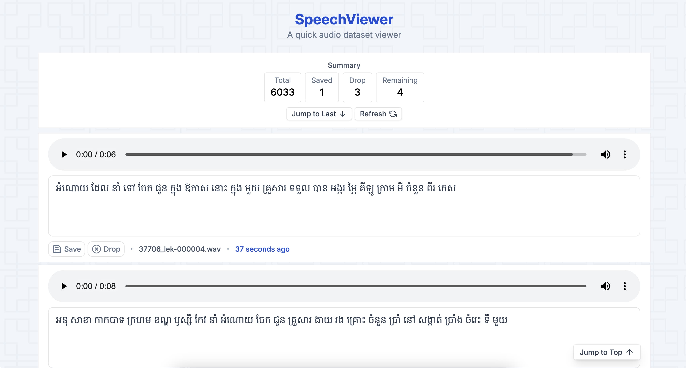

## SpeechViewer

A quick audio dataset viewer.



```shell
npx speechviewer [dataset_path] [app_path]
```


### Required Dataset Format

SpeechViewer expects the following dataset format.

```
/path/to/dataset
├── metadata.tsv
└── wavs
    ├── 000001.wav
    ├── 000002.wav
    ├── 000003.wav
```

- `metadata.tsv` a tab delimited text file.

```tsv
000001.wav	this is transcription
000002.wav	this is transcription
000003.wav	this is transcription
```


### License

Apache-2.0